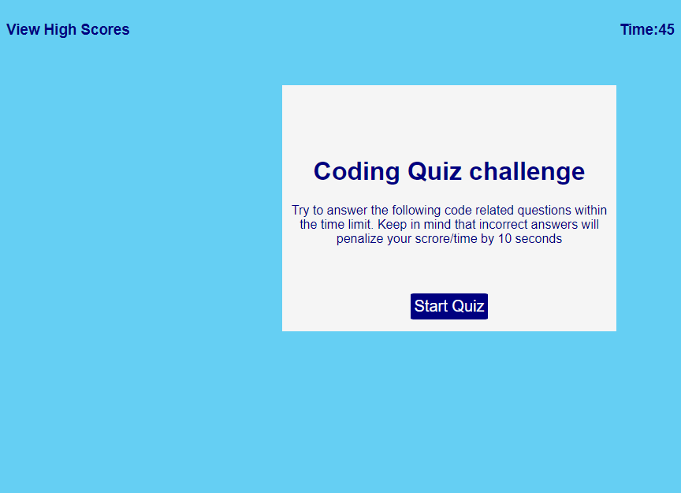

# Code-quiz
This website is designed to give web developers a chance to test their javascript knowledge.  The questions are basic javascript related questions that will enable the user to determine if they've got a basic understanding of javascript principles.  

## Motivation
My motivation for this website was to creat a site that allows a user to test their Javascript knowledge.  If a user is unable to answer the questions, they'll know they need to study more to gain a better understanding of Javascript. 

### Contributors
I want to thank Aaron Weiner for giving me the idea to add background color to my answer buttons.  While no code was shared between us, I do want to acknowledge that he mentioned this to me and gave me permission to also do this on my site.  

### Image of my website

 

### Website Address

Visit my [Website](https://joshwalters34.github.io/Code-quiz/)

### Repository

View my [GitHub_Repository](https://github.com/joshwalters34/Code-quiz)